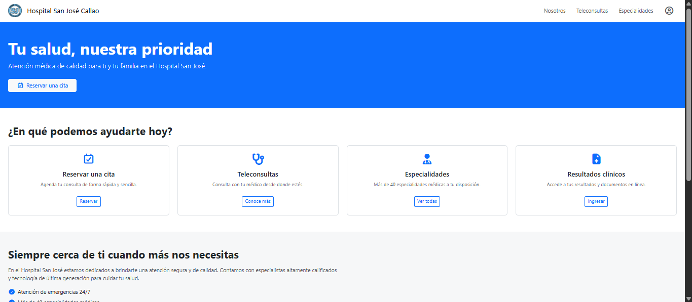
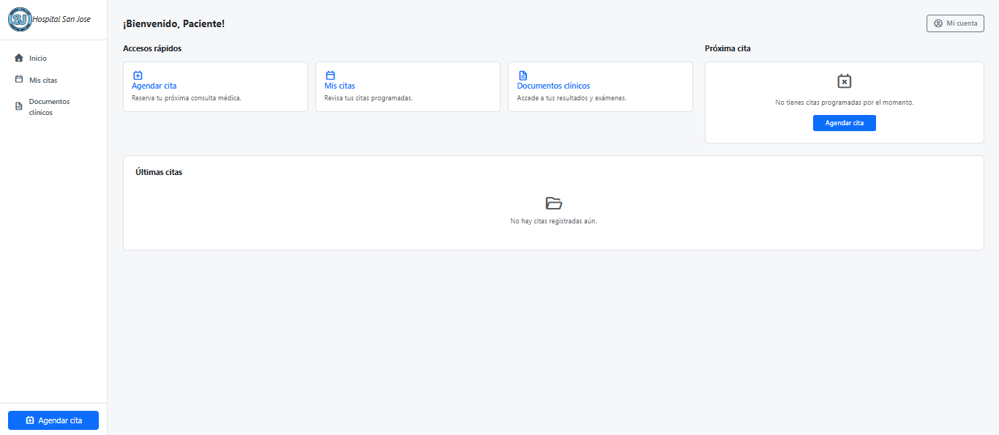
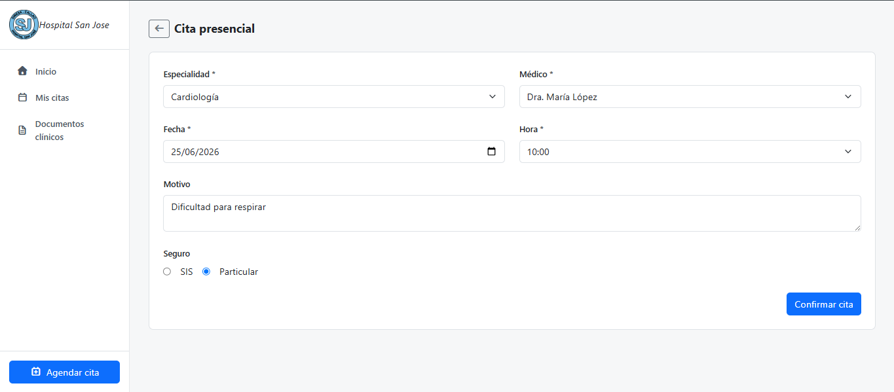
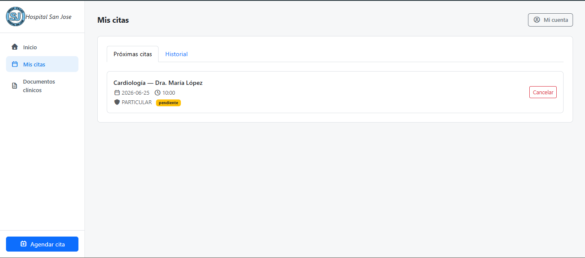

# 🏥 Hospital Management System

> Sistema completo de gestión hospitalaria basado en arquitectura serverless en AWS

---

## 🚀 ¿Qué es este proyecto?

Este sistema simula una plataforma real de gestión hospitalaria con autenticación de usuarios, gestión de citas médicas y administración de información clínica.

Está diseñado con una arquitectura moderna **frontend + backend serverless en AWS**, simulando un entorno de producción real.

---

## 🎯 Problema que resuelve

- Gestión manual de citas médicas
- Falta de centralización de información de pacientes
- Procesos clínicos no digitalizados
- Baja escalabilidad en sistemas tradicionales

---

## ⚙️ Solución implementada

Sistema web con:

- 🧑‍⚕️ Gestión de usuarios
- 📅 Reserva de citas médicas
- 🏥 Visualización de servicios médicos
- 🔐 Autenticación segura
- 📊 Panel de administración interno

---

# ☁️ Arquitectura del sistema (AWS Serverless)

## 🧠 Diagrama conceptual

---

## 🌐 Endpoint del sistema
https://706feh7y28.execute-api.us-east-1.amazonaws.com

---

## 🔗 API Endpoints

### 🔐 Auth
- `/auth/register`
- `/auth/login`

### 📚 Catálogos
- `/catalogos`
- `/medicos`
- `/modalidades`
- `/seguros`
- `/horarios`

### 📅 Citas
- `/citas`

### 👤 Usuarios
- `/usuario/{id}`
- `/usuarios/{id}`

### 📄 Documentos
- `/documentos/{id}`

---

## 🗄️ Base de datos (DynamoDB)

- TB_USUARIO
- TB_CITAS
- TB_MEDICOS
- TB_HORARIOS

---

## ☁️ Arquitectura AWS utilizada

- ⚡ AWS Lambda (lógica serverless)
- 🌐 API Gateway (exposición REST)
- 🗄️ DynamoDB (NoSQL database)
- 📊 CloudWatch (logging y monitoreo)

---

## 🖥️ Frontend

- Angular
- Bootstrap
- Arquitectura modular:
  - Layout (Public / Private)
  - Pages (Public / Private)
  - Services (Auth, Citas, Usuario, Catálogo)
  - Models (Usuario, Cita, Documento)

---

## 📸 Capturas del sistema

### 🏠 Vista pública

### 🔐 Login

### 🧭 Dashboard privado

### 📅 Agendar cita

### 📋 Mis citas

---

## 💡 Arquitectura destacada

- Arquitectura serverless real en AWS
- Separación frontend / backend
- Microservicios en Lambda
- Base de datos NoSQL escalable
- API REST centralizada

---

## 👨‍💻 Autor

**Joaquín Huamán**  
Arquitectura de Datos | Cloud | BI | Desarrollo Web

---

## 📌 Estado

✔ Funcional  
✔ Backend desplegado en AWS  
✔ Frontend Angular operativo  
🚀 Listo para portafolio profesional
