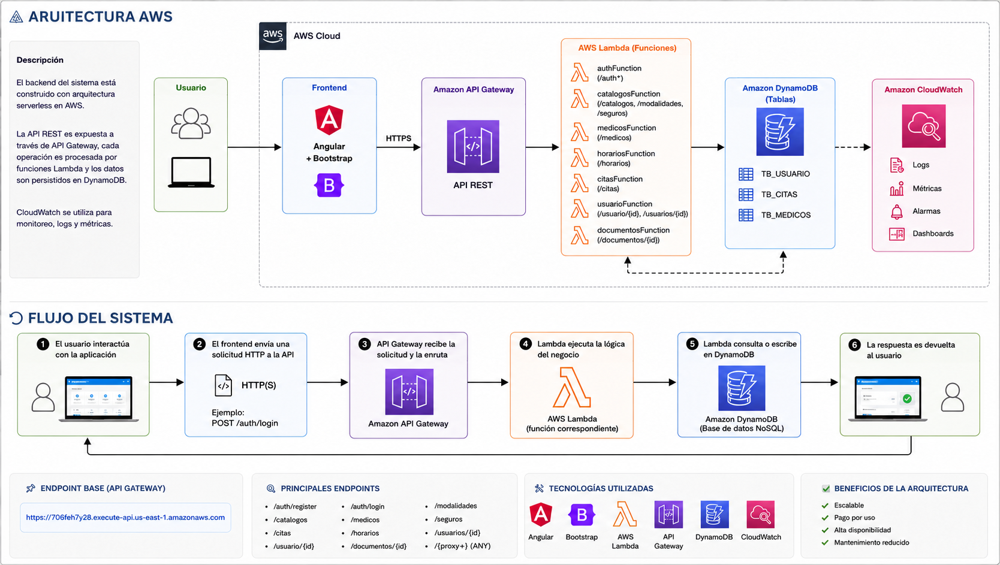

# 🏥 Hospital Management System (Serverless AWS)

> Plataforma moderna de gestión hospitalaria construida con arquitectura **100% serverless en AWS**
>
> Simula un sistema real en producción: autenticación, citas médicas y gestión clínica escalable.

---

## ¿Qué es este proyecto?

Este es un sistema web completo de gestión hospitalaria diseñado como solución cloud moderna.

Implementa una arquitectura **frontend + backend serverless**, donde cada operación se ejecuta mediante funciones Lambda expuestas por API Gateway y persistidas en DynamoDB.

👉 En pocas palabras:  
Un sistema hospitalario escalable, modular y listo para producción en la nube.

---

## 🎯 Problema que resuelve

En entornos clínicos tradicionales existen problemas como:

- Gestión manual de citas
- Información de pacientes dispersa
- Procesos lentos y no digitalizados
- Sistemas poco escalables

---

## 💡 Solución

Se construyó una plataforma que centraliza todo en la nube:

- Gestión de usuarios y autenticación
- Reserva y administración de citas médicas
- Catálogo de servicios médicos
- Seguridad con API centralizada
- Arquitectura preparada para escalar

---

## ☁️ Arquitectura del sistema (AWS Serverless)

### Vista general

---

### Stack cloud utilizado

- ⚡ **AWS Lambda** → lógica del negocio (serverless)
- 🌐 **API Gateway** → exposición de endpoints REST
- 🗄️ **DynamoDB** → base de datos NoSQL
- 📊 **CloudWatch** → logs, métricas y monitoreo

---

## Flujo del sistema

1. El usuario interactúa desde el frontend (Angular)
2. Se envía una solicitud HTTP a la API
3. API Gateway enruta la petición
4. Lambda ejecuta la lógica del negocio
5. DynamoDB guarda o consulta datos
6. Se responde al usuario en tiempo real

---

## 🌐 API Base
https://706feh7y28.execute-api.us-east-1.amazonaws.com

---

## 🔗 Endpoints principales

### 🔐 Autenticación
- `POST /auth/register`
- `POST /auth/login`

### 📚 Catálogos
- `/catalogos`
- `/medicos`
- `/modalidades`
- `/seguros`
- `/horarios`

### 📅 Citas
- `/citas`

### 👤 Usuarios
- `/usuario/{id}`
- `/usuarios/{id}`

### 📄 Documentos
- `/documentos/{id}`

---

## Base de datos (DynamoDB)

- TB_USUARIO
- TB_CITAS
- TB_MEDICOS
- TB_HORARIOS

---

## Frontend

- Angular 
- Bootstrap 
- Arquitectura modular:
  - Layouts (Public / Private)
  - Pages
  - Services (API, Auth, Citas)
  - Models (Usuario, Cita, etc.)

---

## Arquitectura destacada

✔ Serverless real en AWS  
✔ Backend desacoplado del frontend  
✔ Escalabilidad automática  
✔ Alta disponibilidad  
✔ Pago por uso (coste optimizado)  

---

##  Capturas del sistema

- Vista pública  
- Login  
- Dashboard  
- Agendamiento de citas  
- Gestión de citas  

---

## 👨‍💻 Autor

**Joaquín Huamán**  
Arquitectura de Datos | Cloud | BI | Desarrollo Web

---
